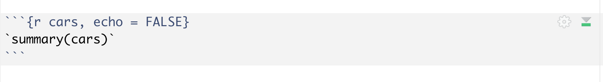
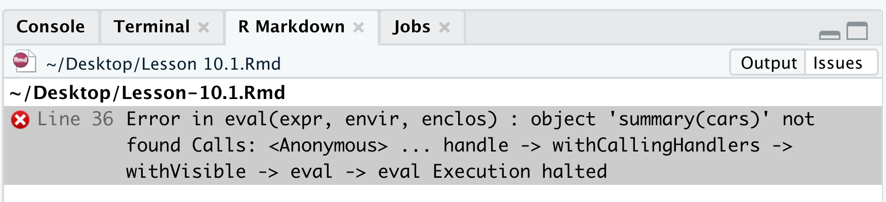

## Text Formatting in R Markdown {#rmd-text-formatting}

You've learned about the powerful YAML header and the utility of R Code Chunks in Section \@ref(intro-r-markdown). Now, your journey continues into the art of **text formatting**. A well-formatted report is not just professional; it's a powerful tool to guide your reader through your data story.

R Markdown uses **Pandoc's Markdown**, a simple yet powerful syntax for creating beautifully formatted documents. Think of the text in your `.Rmd` file as your raw materials (**marked-up text**), and the  knitted document as your polished creation (**formatted text**).

Let's explore the tools at your disposal.

### Headers: Your Document's Signposts

Use different numbers of hash symbols (`#`) to create up to six levels of headers. More `#` symbols mean a lower-level header.

``` markdown
# Level 1: The Chapter Title
## Level 2: A Major Section
### Level 3: A Subsection
#### Level 4: A Sub-subsection
##### Level 5: A Sub-sub-subsection
###### Level 6: A Sub-sub-sub-subsection
```

**Pro-Tip:** Set `number_sections: true` in the YAML header to automatically number your sections.

### Emphasis: Making Your Point

Markdown allows you to emphasize text in various ways. Here are some common styles:

| Style                 | Syntax                   | Example                                    |
|-----------------|---------------------|----------------------------------|
| *Italics*             | `*text*` or `_text_`     | *For emphasis or scientific names*         |
| **Bold**              | `**text**` or `__text__` | **To show strong importance**              |
| \~\~Strikethrough\~\~ | `~~text~~`               | \~\~This idea was later disproven.\~\~     |
| `Code Font`           | `` `text` ``             | Use for `function_names()` or `variables`. |

### Inline Code: Displaying and Evaluating

You can include code within your sentences in two ways:

-   To display code as text: Wrap it in single backticks. For example, `1 + 1` renders as 1 + 1.
-   To evaluate code and show its output: Use inline R code with `` `r ` ``. For example, `` `r knitr::inline_expr('1 + 1')` `` evaluates to **2** in the output.

> **Heads‑up:** Never wrap code *inside* a code chunk with back‑ticks: `knitr()` will treat them as unmatched delimiters and throw an error when you knit.

```{r incorrect-back-tick-code, results=TRUE, echo=FALSE, fig.align = 'center', fig.cap="Incorrect back-ticks in a code chunck", out.width = '90%'}

```

```{r incorrect-back-tick-code-error, results=TRUE, echo=FALSE, fig.align = 'center', fig.cap="The error message", out.width = '90%'}

```

### Lists: Ordered and Unordered

Use lists to organize information and break down complex topics.

-   **Unordered Lists**: Start each line with `*`, `+`, or `-`.
-   **Ordered Lists**: Start each line with a number. R Markdown will automatically sequence them correctly, even if you use 1. for every item.
-   **Nested Lists**: Indent items to create sub-lists. You can mix and match ordered and unordered lists.

Here is an example of a mixed list:

``` markdown
1.  First, collect the data.
2.  Second, clean the data.
    * Check for missing values (`NA`).
    * Ensure correct data types.
3.  Finally, analyze the data.
```

1.  First, collect the data.
2.  Second, clean the data.
    -   Check for missing values (`NA`).
    -   Ensure correct data types.
3.  Finally, analyze the data.


### Hyperlinks: Connecting to the World

Guide your readers to external resources with hyperlinks. The format is `[Text to display](URL)`.

```markdown
I have learned R from the book [r02pro](https://r02pro.github.io/).
```

This will create a clickable link in the output document that says 

I have learned R from the book [r02pro](https://r02pro.github.io/).

### Blockquotes: Highlighting Wisdom

Use the `>` character to create a blockquote. This is perfect for quoting sources or emphasizing a key insight.

```markdown
> "The best thing about being a statistician is that you get to play in everyone's backyard." - John Tukey
```

This will generate 

> "The best thing about being a statistician is that you get to play in everyone's backyard." - John Tukey


### Footnotes: Adding Extra Details

Add non-essential details or citations using footnotes. Use `[^1]` for the marker and define it anywhere in your document. A more convenient inline method is `^[Your footnote text here.]`.

```markdown
This is a statement with a footnote.[^1]

[^1]: This is the footnote text that provides additional information.
```

This is a statement with a footnote.[^1]

[^1]: This is the footnote text that provides additional information.


### The Language of the Universe: Writing Mathematics

R Markdown allows you to write beautiful mathematics using LaTeX syntax.

#### Inline Equations

For small formulas that fit within a line of text, wrap your LaTeX code in single dollar signs (`$`).

```markdown
**Fun Fact:** Did you know that Euler's Identity, 
$e^{i\pi} + 1 = 0$, connects five of the most fundamental constants in mathematics?
```

**Fun Fact:** Did you know that Euler's Identity, $e^{i\pi} + 1 = 0$, connects five of the most fundamental constants in mathematics?

#### Displayed Equations

For larger equations that deserve their own line, wrap them in double dollar signs (`$$`).


```markdown
*Statistical Insight:* The probability density function of the normal distribution $N(\mu, \sigma^2)$, a cornerstone of statistics, is given by:
$$ f(x) = \frac{1}{\sqrt{2\pi\sigma^2}} e^{-\frac{(x-\mu)^2}{2\sigma^2}} $$
```

*Statistical Insight:* The probability density function of the normal distribution $N(\mu, \sigma^2)$, a cornerstone of statistics, is given by:
$$ f(x) = \frac{1}{\sqrt{2\pi\sigma^2}} e^{-\frac{(x-\mu)^2}{2\sigma^2}} $$


### Tables: From Simple to Stunning

You can create simple tables using Markdown syntax. For example:

```markdown
| Operator | Description    |
|----------|----------------|
| `+`      | Addition       |
| `-`      | Subtraction    |
| `*`      | Multiplication |
| `/`      | Division       |
```

| Operator | Description    |
|----------|----------------|
| `+`      | Addition       |
| `-`      | Subtraction    |
| `*`      | Multiplication |
| `/`      | Division       |

In later chapters, you will learn how to automatically generate tables from your data using R functions.


### Your Turn: A Mini-Challenge

Time to get your hands dirty! Create a new `.Rmd` file and try to build the following mini-report. This is the best way to solidify your new skills.

1.  **Create a Level 1 Header:** "My Favorite Mathematical Constant"
2.  **Write a sentence in bold** explaining what your favorite constant is (e.g., **My favorite constant is  $\pi$**).
3.  **Add a blockquote** with a fun fact about it.
4.  **Create an ordered list** with at least two reasons why you like it.
5.  **Include an inline R calculation.** For example: "A circle with a radius of 5 units has a circumference of `` `r  knitr::inline_expr('2 * pi * 5')` `` units."
6.  **Add a footnote** with a link to a Wikipedia article about your chosen constant.

Good luck, and happy formatting\!

An example .Rmd file is below for your reference. 

```markdown
---
title: "Mini-Challenge Solution: My Favorite Mathematical Constant"
output: html_document
---

# My Favorite Mathematical Constant

**My favorite constant is  $e$**

> Euler's number, $e$, is approximately 2.71828 and is the base of the natural logarithm. It appears everywhere in growth processes, probability, and calculus!

Here are a few reasons why I like $e$:

1. It describes continuous growth and exponential change perfectly.
2. It has deep connections to calculus, particularly in limits and derivatives.

For example, if something grows continuously at a rate of 100%, after 1 unit of time it grows to:

`r knitr::inline_expr('exp(1)')` units.

You can learn more about $e$ on its [Wikipedia page](https://en.wikipedia.org/wiki/E_(mathematical_constant)).[^1]

[^1]: Wikipedia article: https://en.wikipedia.org/wiki/E_(mathematical_constant)
```
