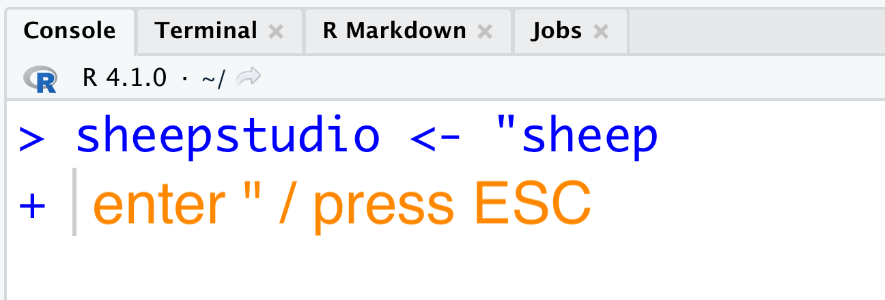
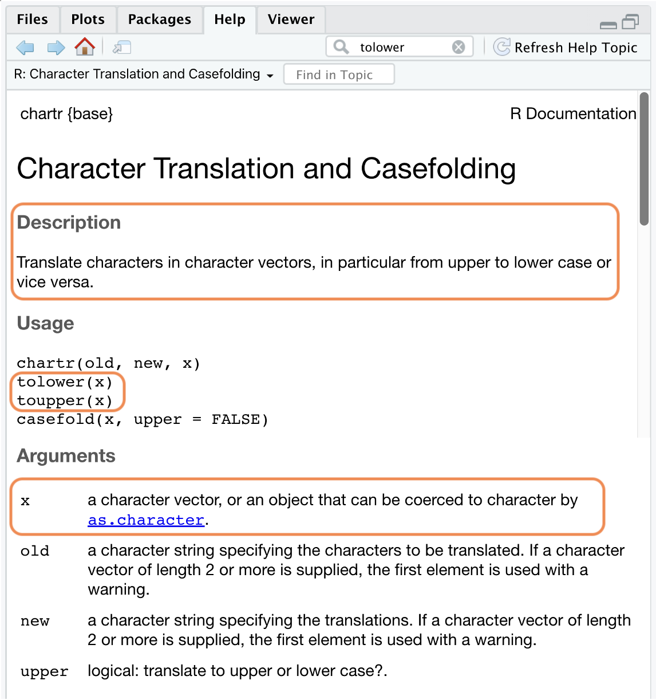
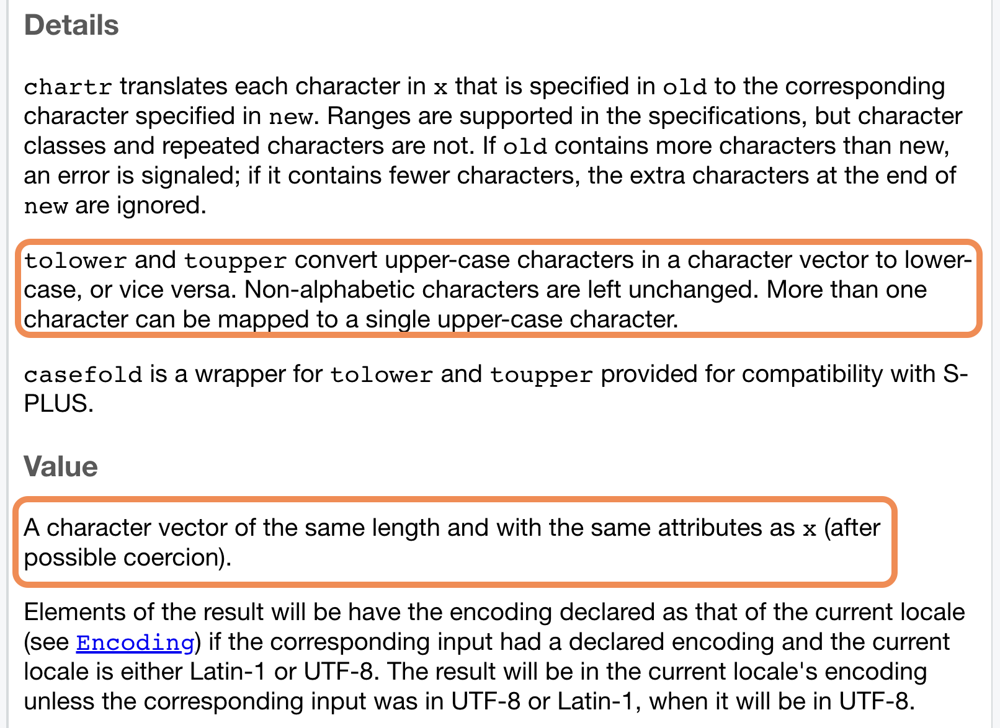
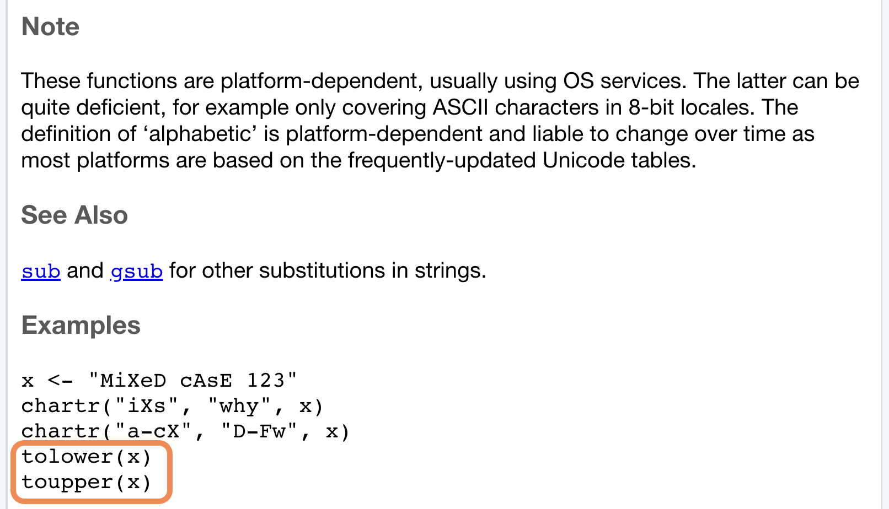
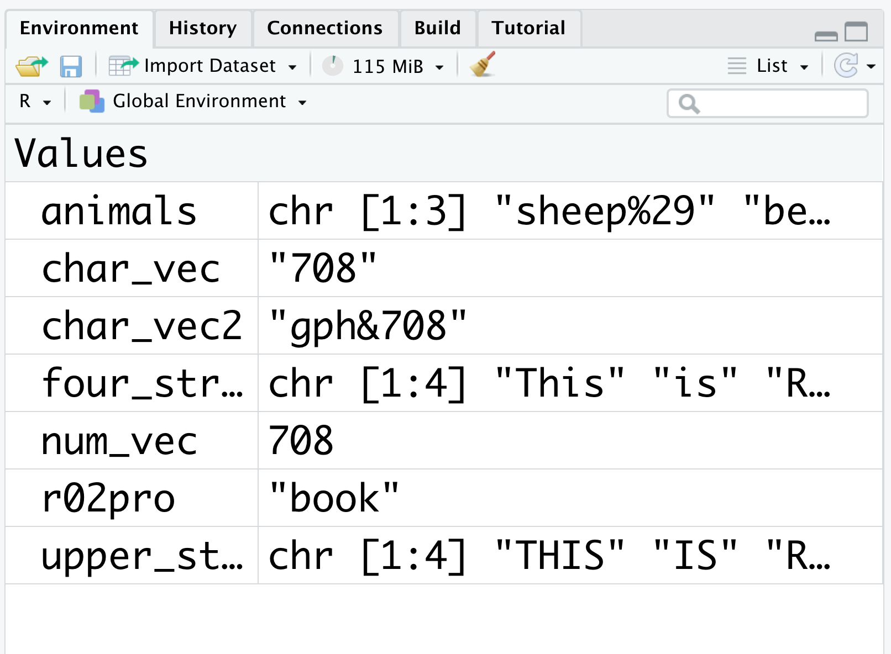

## Introduction to Character Vectors {#intro-char-vector} 

In Section \@ref(intro-num-vector), we introduced numeric vectors. Now we will learn another member of the atomic vector family: character vectors. 

### Creation, class, and storage type {#create-character-vector} 

A **character vector** is an atomic vector in which all elements are *strings*. A string is a sequence of characters (letters, numbers, or symbols) surrounded by double quotes (e.g. \"a_string\") or single quotes (e.g. \'another_string\'). For consistency, we will stick with double quotes in this book.

For example, when the word book is surrounded by a pair of double quotes, it becomes a string, and `"book"` is a character vector with length 1. The value of `"book"` is the string itself. Notice that `"book"` is a vector **without** a name since we have not assigned its value to an object. You can verify the vector length with `length()` and the type with `class()`.

```{r}
"book"
length("book")
class("book")
```

As you can see, the length of the character vector is 1, which means it contains only one element. The `class()` function returns `character`, indicating that this is a character vector.

Next, assign the value of `"book"` to a name (say `r02pro`) using the assignment operator `<-`. This creates a named character vector. 


```{r}
r02pro <- "book"
r02pro
class(r02pro)
```


::: {.infobox .caution data-latex=""}
Double quotes need to be paired in strings. If you miss the right double quote, R will show a plus on the next line, waiting for you to finish the command. If this happens, you can either enter the matching double quote, or press ESC to escape this command.
:::


```{r quo, results=TRUE, echo=FALSE, fig.align = 'center', fig.cap="Miss the right quotation mark", out.width = '70%'}

```


Next, create a numeric vector `num_vec` with the number 708. After adding a pair of double quotes around 708, `"708"` becomes a string. You can assign the value `"708"` to a name (say `char_vec`), which will create a new character vector named `char_vec`. Use `class()` to verify the vector type if you are not sure.

```{r}
num_vec <- 708
char_vec <- "708"
class(num_vec)
class(char_vec)
```

Strings can also contain symbols. For example, you can create a character vector with `"gph&708"`.

```{r}
char_vec2 <- "gph&708"
class(char_vec2)
```

In R, characters (including letters, numbers, and symbols) surrounded by double quotes are interpreted as a string. 

As with numeric vectors, you can have multiple elements in a character vector by using the `c()` function to combine several strings into a single vector. You can verify the number of elements in a vector by using the `length()` function. 

Now we know how to obtain the length of a vector, but what about the length of a single element within a given vector? The `nchar()` function returns the number of **characters** in a string.

```{r}
animals <- c("sheep%29", "bear$11", "monkey@66")
animals
length(animals)
nchar(animals)
```

As shown in the example, there are three elements in the `animals` vector, and the string "sheep%29" has a length of 8 (5 letters, 1 symbol, and 2 numbers). Similarly, "bear$11" and "monkey@66" have lengths of 7 and 9. You can verify these with the `nchar()` function. 

As with numeric vectors, you can use the `typeof()` function to find the internal storage type of a character vector. All character vectors have storage type `character` in R. You can check the storage type of some character vectors we created before.

```{r}
typeof(char_vec)
typeof(animals)
```

Finally, you can use the `vector(mode, length)` function to create a character vector of a specified length. 
```{r}
vector("character", 6)
```

Note that the default value is an empty string for all elements.

### Change case {#case}

Strings can contain both uppercase and lowercase letters. You can standardize case across a vector. Let's review the character vector `four_strings` first:

```{r results=TRUE}
four_strings <- c("This", "is", "R02#", "$Pro")
four_strings
```

As you can see, the vector `four_strings` contains a mix of uppercase, lowercase, numbers, and symbols. To convert all letters in each string to lowercase, you can use the `tolower()` function. 

The converted result can be shown directly or saved as a new vector with a name of your choice. For example, after `four_strings` is passed to `tolower()`, the returned result is saved to `lower_strings`. 

```{r results=TRUE}
lower_strings <- tolower(four_strings)
lower_strings
```

Notice that numbers and symbols within a string will not be changed, as they are non-alphabetic characters. 
The opposite operation of `tolower()` is `toupper()`, which converts letters in the vector to uppercase.

```{r results=TRUE}
upper_strings <- toupper(four_strings)
upper_strings
```

### Review of getting help in R

In Section \@ref(get-help), we introduced three common ways to get help in R. In this section, we will review these methods by taking `toupper()` and `tolower()` as examples.

- Use a question mark followed by the function name `?tolower`
- Use the help function `help(tolower)` 
- Use the help window in RStudio 

Use any of the methods listed above to get the documentation for the function `tolower()`, and let's take a detailed look at it. 

Unlike the documentation of the `sign()` function, the title is "Character Translation and Casefolding" (Figure \@ref(fig:help1)).

```{r help1, results=TRUE, echo=FALSE, fig.align = 'center', fig.cap="Help (I)", out.width = '70%'}

```

- The *Description* part describes the general purpose of this function. In this example, all functions introduced in this documentation translate characters in a character vector (from upper to lower case or vice versa).
- The *Usage* part shows the expected syntax. This section may contain multiple functions that share similar usage, but with different numbers and formats of input. For example, `chartr()` expects three arguments (`old`, `new`, and `x`), whereas `tolower()` and `toupper()` take only one argument, `x`. 
- The *Arguments* part provides detailed explanation for each argument. Depending on the function, arguments can differ in data type and length, so it is best to read them individually. For our example, you can focus on the explanation of `x` for `tolower()` and `toupper()` for now, as this is the only required input for both of them. 

Next, let's move to the *Details* part.

```{r help2, results=TRUE, echo=FALSE, fig.align = 'center', fig.cap="Help (II)", out.width = '70%'}

```

- The *Details* part explains the mechanism of the functions, as well as what each of them can achieve. 
- The *Value* part shows the result that the function would return, with specified data attributes and types. For `tolower()` and `toupper()`, since we only convert the case of characters, the returned character vector has the same `length()` as the input vector. 

```{r help3, results=TRUE, echo=FALSE, fig.align = 'center', fig.cap="Help (III)", out.width = '70%'}

```

In the last part of the documentation, you can see notes in the *Note* part and related functions in the *See Also* part. Remember to try the sample code in the *Examples* part and adapt it to your own work.


At the end of this section, let us review the Environment pane. You can see all the character vectors **with names** in this section. Notice that the vector type is shown as `chr` (short for character). 

```{r char, results=TRUE, echo=FALSE, fig.align = 'center', fig.cap="Character vectors", out.width = '70%'}

```

You can also see the list of all the named objects by using the `ls()` function.

```{r, results = TRUE}
ls()
```

### Exercises

1. Write R code to create a character vector named `char_1` with values `"I"`, `"am"`, `"learning"`, `"R!"`, get its length, find out its type, and concatenate the vector into a single string with a space as the separator.

2. For the `char_1` defined in Q1, find the number of characters in each string, and convert each string to uppercase.


